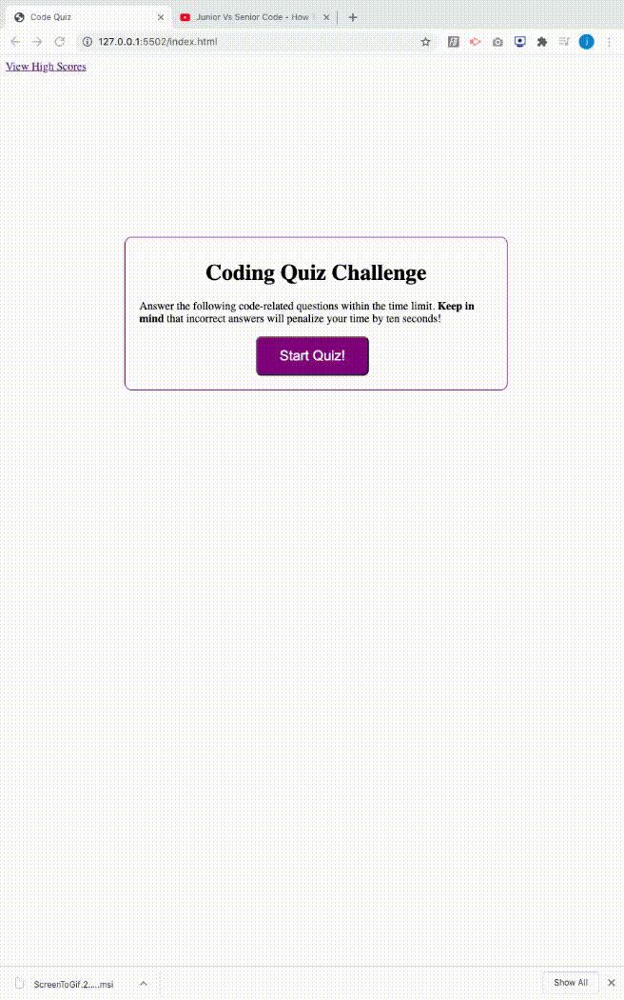
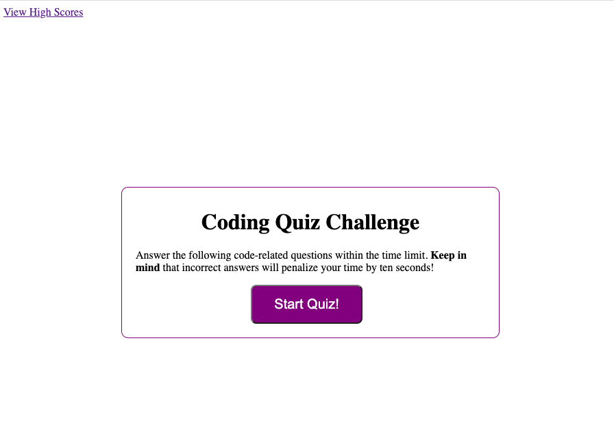
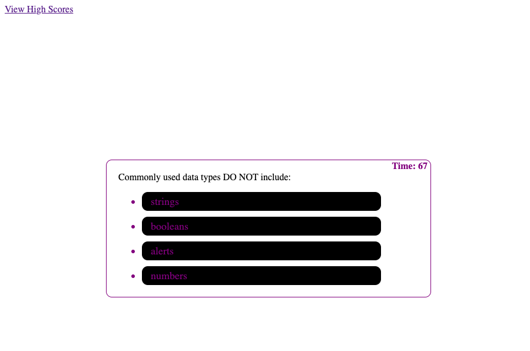
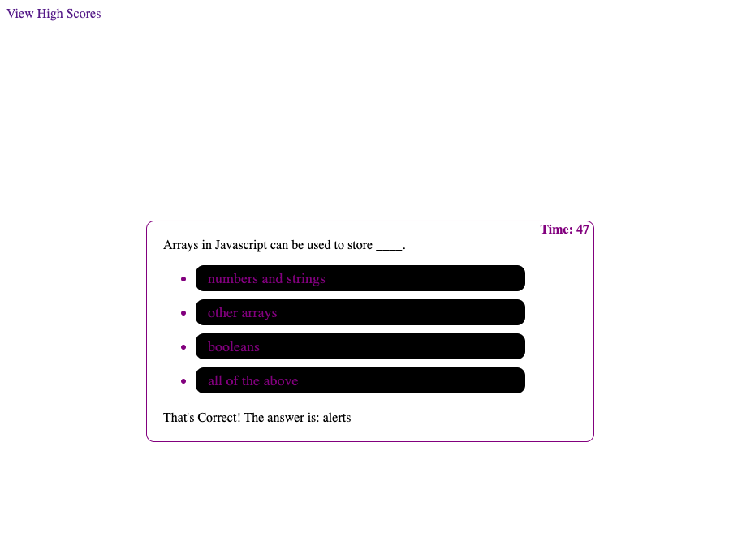
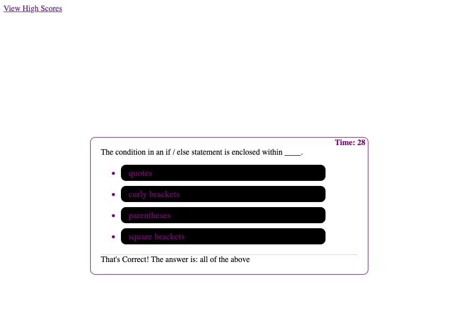
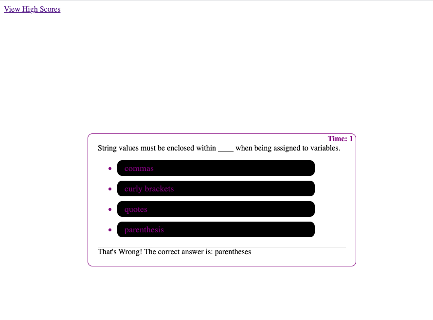
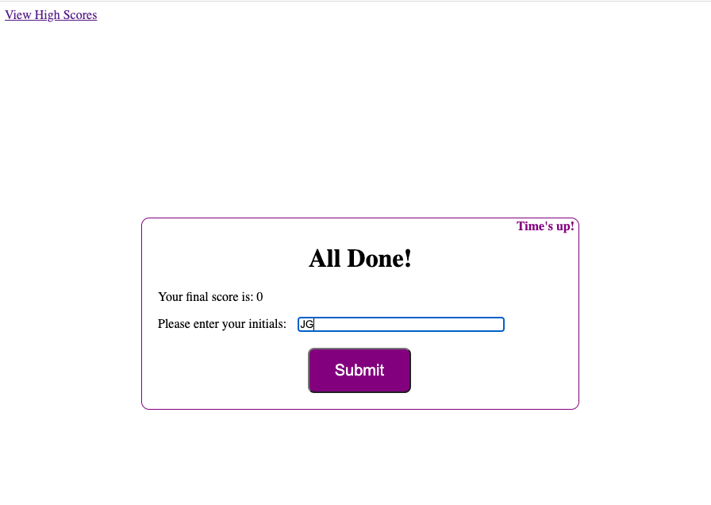
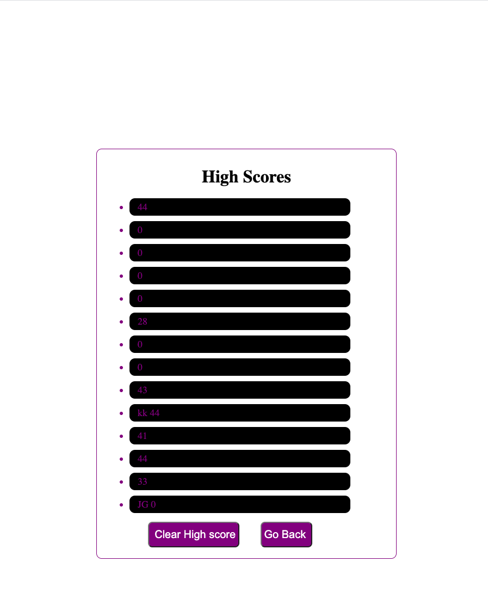

# Challenge-4-Web-API-Code-Quiz

UCF Coding Bootcamp Homework 4.

This is a quiz application using HTML, CSS, and Javascript. This application emphasizes the use of Javascript to provide quiz questions and collect user data to determine whether the answers to a question are correct, this then generates a score and appends a final page of results from the user data. 

This project has been deployed to GitHub Pages. To get this project up and running, you can follow the deployment link. Or, download the sources files to use this as a template.

* [GitHub Repository](https://github.com/jcgom3/Challenge-4-Web-API-Code-Quiz)
* [Deployed GitHub IO](https://jcgom3.github.io/Challenge-4-Web-API-Code-Quiz/)

### Summary
* HTML and CSS and Javascript documents create a quiz with multiple choice questions with time countdown and time deduction when answering the wrong question
* This project emphasizes the use of Javascript to make changes to an HMTL document
* This project utilizes the use of appending HTML pages 

### This project has the following features: 
* A Start Quiz button 
    * This starts a timer for the user
    * Each question averages 15 seconds each for a total time of 75 seconds + 1. 

* An appended HTML page which contains questions and multiple choice answers
    * If questions are answered incorrectly, 10 seconds are deducted off remaining time
    * Answers are recording using an event listener, "click" and tracks correct answers

* An appended HTML page that features: 
    * Final score which is calculated using time remaining
    * A Summary of how many questions answered correctly 
    * Input area to record initials
    * A Submit button
    * Submit buttom saves initials and score to local storage

* A Highscores HTML
    * This a list summary of intials and final scores
    * Clear button resets the page and local storage
    * Go back button redirects user to the start of the quiz

### This project has media Queries for:
* max-width: 980px, 786px, 640px
    * Adjusts body and container width
    * Adjusts buttons to be centered and stacked

### Features: 
* Two HTML Pages
    * Index.html 
        * Contains landing page to start timer
        * Appends two new pages 
    * Highscores.html 
        * Retreives local data from previous page
* One CSS Page
    * Styles.css
        * Contains centering, styling and hovering for html list features
        * Contains media queries

* Two Javascript Pages for questions and one for the high scores
    * questions.js & HighScores.js
        * Variables, including arrays with object
        * Event listeners when user clicks
        * if/else if statements
        * For Loops
        * Functions 
        * Local Storage set and get 

## Authors

* **Juan Carlos Gomez** - [Git Hub Profile](https://github.com/jcgom3)

